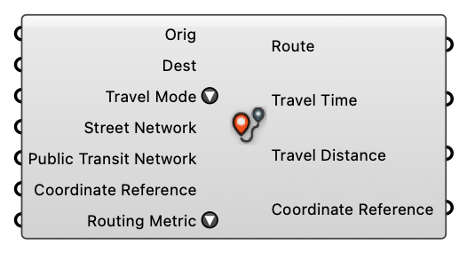

##  Router

Find a trip between two places (buildings/points/curves) using the specified mode

#### Input
* ##### Orig [Geometry]
  Origin Point/Building
* ##### Dest [Geometry]
  Destination Point/Building
* ##### Travel Mode [Text]
  Travel Mode
* ##### Street Network [Street Network]
  Street Network
* ##### Public Transit Network [Public Transit Network]
  Public Transit Network
* ##### Coordinate Reference [CR]
  Coordinate reference information for properly locating the geometries in the Rhino canvas
* ##### Routing Metric [Text]
  Routing Metric

#### Output
* ##### Route [Curve list]
  Curve representing the route of the trip
* ##### Travel Time [Number]
  Travel time in minutes
* ##### Travel Distance [Number]
  Travel distance in meters
* ##### Coordinate Reference [CR]
  Coordinate reference information for properly locating the geometries in the Rhino canvas