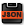
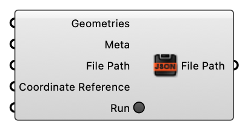

##  Save Data To Geojson

Save Data To Geojson

#### Input
* ##### Geometries [Geometry list]
  Geometries
* ##### Meta [CR list]
  Serializable dictionary with string keys and arbitrary values
* ##### File Path [Text]
  File Path
* ##### Coordinate Reference [CR]
  Coordinate reference information for properly locating the geometries in the Rhino canvas
* ##### Run [Boolean]
  Run

#### Output
* ##### File Path [Text]
  File Path