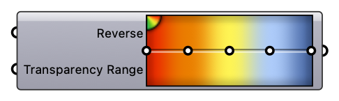

#  Urbano Gradient

Represents a multiple colour gradient. The Reverse and Transparency inputs modify the gradient permanently.

#### Input
* ##### Reverse [Boolean]
  Reverse the gradient. Use a button for one-shot action.
* ##### Transparency Range [Domain]
  Transparency Range

#### Output
* ##### Gradient [Generic Data]
  Gradient