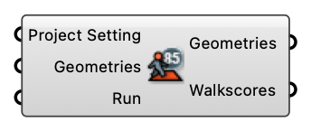

#  Walkscore Component

Compute Walkscore values for input geometries using Itinero routing to amenity POIs extracted from OSM.

#### Input
* ##### Project Setting [CR]
  Project Setting
* ##### Geometries [Geometry list]
  Geometries to evaluate (mesh, curve, point, etc.). Center points are used as walkscore locations.
* ##### Run [Boolean]
  Set to true to compute walkscores. When false, outputs previously cached results.

#### Output
* ##### Geometries [Geometry list]
  Input geometries (pass-through)
* ##### Walkscores [Number list]
  Walkscore per geometry (0-100)