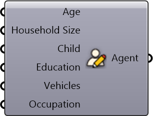

#  Create Agent

Create Agent

#### Inputs
* ##### Age []
Age
* ##### Household Size []
Count of household members
* ##### Child []
Have Child Or Not?
* ##### Education []
Whether have bachelor degree
* ##### Vehicles []
Count of household vehicles
* ##### Occupation []
Occupation

#### Outputs
* ##### Agent
Agent