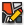

#  Create Block

Create Block

#### Inputs
* ##### Point []
Point
* ##### Polygon []
Polygon
* ##### Meta []
Block Meta
* ##### Coordinate Reference []
Coordinate reference information for properly locating the geometries in the Rhino canvas

#### Outputs
* ##### Block
Block
* ##### Coordinate Reference
Coordinate reference information for properly locating the geometries in the Rhino canvas