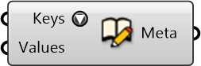

#  Create Metadata

Create metadata from field names (keys) and corresponding values.

#### Inputs
* ##### Keys []
Field names (keys) in the metadata.
* ##### Values []
Values corresponding to keys in the metadata.

#### Outputs
* ##### Meta
Dictionary with keys and values that can be attached to Rhino geometries.