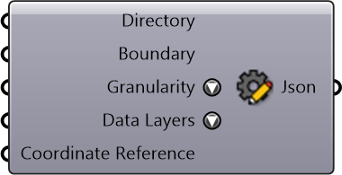

#  Create Project Setting

Create Project Setting

#### Inputs
* ##### Directory []
Project directory to save and cache files
* ##### Boundary []
A string representing geographical boundary
* ##### Granularity []
Granularity
* ##### Data Layers []
Data Layers
* ##### Coordinate Reference []
Coordinate reference information for properly locating the geometries in the Rhino canvas

#### Outputs
* ##### Json
Json