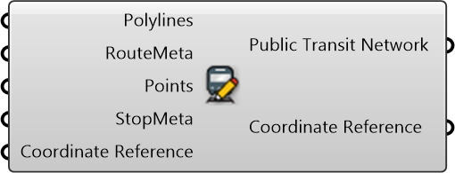

#  Create Public Transit Network

Create Public Transit Network

#### Inputs
* ##### Polylines []
Route Polylines
* ##### RouteMeta []
Route Meta
* ##### Points []
Stop Points
* ##### StopMeta []
Stop Meta
* ##### Coordinate Reference []
Coordinate reference information for properly locating the geometries in the Rhino canvas

#### Outputs
* ##### Public Transit Network
Public Transit Network
* ##### Coordinate Reference
Coordinate reference information for properly locating the geometries in the Rhino canvas