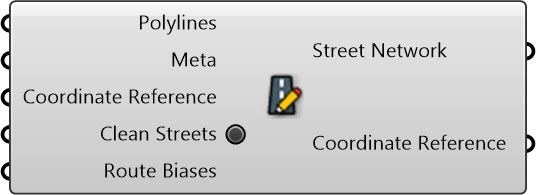

#  Create Street Network

Create Street Network

#### Inputs
* ##### Polylines []
Street Polylines
* ##### Meta []
Street Meta
* ##### Coordinate Reference []
Coordinate reference information for properly locating the geometries in the Rhino canvas
* ##### Clean Streets []
Clean Streets
* ##### Route Biases []
Route Biases

#### Outputs
* ##### Street Network
Street Network
* ##### Coordinate Reference
Coordinate reference information for properly locating the geometries in the Rhino canvas