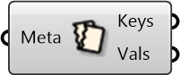

#  Deconstruct Metadata

Deconstruct Metadata into keys and values

#### Inputs
* ##### Meta []
Dictionary with keys and values that can be attached to Rhino geometries.

#### Outputs
* ##### Keys
Keys in metadata
* ##### Vals
Values in metadata