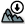
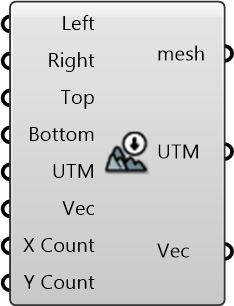

#  Download DEM and Build Terrain Mesh

Download the DEM data and build the terrain mesh (Allow administrator access for Rhino; Wait until the download to be completed in the background and re-enable this component to see the changes)

#### Inputs
* ##### Left []
Left Bound (Longitude, x-axis) of the site
* ##### Right []
Right Bound (Longitude, x-axis) of the site
* ##### Top []
Top Bound (Latitude, y-axis) of the site
* ##### Bottom []
Bottom Bound (Latitude, y-axis) of the site
* ##### UTM []
UTM Zone of the given region (can be used along with translation vector) to transform data from different sources to a common origin)
* ##### Vec []
Translation vector to move from actual UTM window to working origin (can be used to transform data from different sources to a common origin)
* ##### X Count []
Count of mesh vertices on X axis
* ##### Y Count []
Count of mesh vertices on Y axis

#### Outputs
* ##### mesh
Terrain mesh constructed based on the DEM data (data resource: https://dds.cr.usgs.gov/srtm/version2_1/SRTM3/)
* ##### UTM
UTM Zone of the given region (can be used along with translation vector) to transform data from different sources to a common origin)
* ##### Vec
Translation vector to move from actual UTM window to working origin (can be used to transform data from different sources to a common origin)