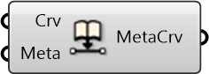

#  Embed Metadata into Curve

Embed Metadata into curve

#### Inputs
* ##### Crv []
Curve to embed metadata to
* ##### Meta []
Dictionary with keys and values that can be attached to Rhino geometries.

#### Outputs
* ##### MetaCrv
Curve with metadata embedded