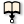
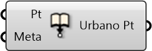

#  Embed Metadata into Point

Embed metadata into point

#### Inputs
* ##### Pt []
Point to embed metadata into
* ##### Meta []
Dictionary with keys and values that can be attached to Rhino geometries.

#### Outputs
* ##### Urbano Pt
Urbano Pt