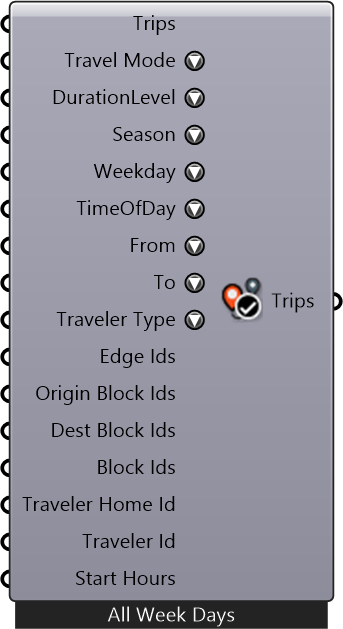

#  Filter Trips

Description

#### Inputs
* ##### Trips []
Trips
* ##### Travel Mode []
Travel Mode
* ##### DurationLevel []
Duration Level
* ##### Season []
Season
* ##### Weekday []
Weekday
* ##### TimeOfDay []
Time of Day
* ##### From []
From Activity
* ##### To []
To Activity
* ##### Traveler Type []
Traveler Type
* ##### Edge Ids []
Get trips that pass certain edges.
* ##### Origin Block Ids []
Get trips that start from certain blocks.
* ##### Dest Block Ids []
Get trips that end in certain blocks.
* ##### Block Ids []
Get trips that either start from or end in certain blocks.
* ##### Traveler Home Id []
Get trips based on the home block id of the traveler.
* ##### Traveler Id []
Get trips based on the index of the traveler within each block.
* ##### Start Hours []
Get trips based on the start hour.

#### Outputs
* ##### Trips
Trips