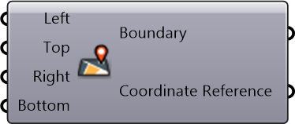

#  Geographic Boundary

Geographic Boundary

#### Inputs
* ##### Left []
Minimum longitude, left boundary.
* ##### Top []
Maximum latitude, top boundary.
* ##### Right []
Maximum longitude, right boundary.
* ##### Bottom []
Minimum latitude, bottom boundary.

#### Outputs
* ##### Boundary
A string representing geographical boundary
* ##### Coordinate Reference
Coordinate reference information for properly locating the geometries in the Rhino canvas