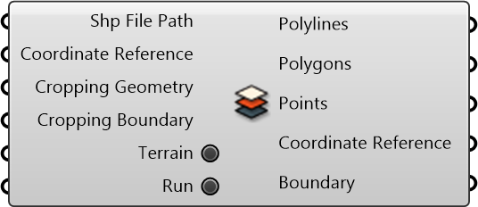

#  Import SHP File

Import data from GIS shapefiles

#### Inputs
* ##### Shp File Path []
Shp file path (.shp)
* ##### Coordinate Reference []
Coordinate reference information for properly locating the geometries in the Rhino canvas
* ##### Cropping Geometry []
Cropping Geometry
* ##### Cropping Boundary []
A string representing geographical boundary. (Use 'Geo Boundary' component to get the string)
* ##### Terrain []
If turned on, the component will try to download corresponding terrain data files into the parent folderof the user-specified file path.
* ##### Run []
Run

#### Outputs
* ##### Polylines
Polylines
* ##### Polygons
Polygons
* ##### Points
Points
* ##### Coordinate Reference
Coordinate reference information for properly locating the geometries in the Rhino canvas
* ##### Boundary
A string representing geographical boundary