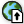
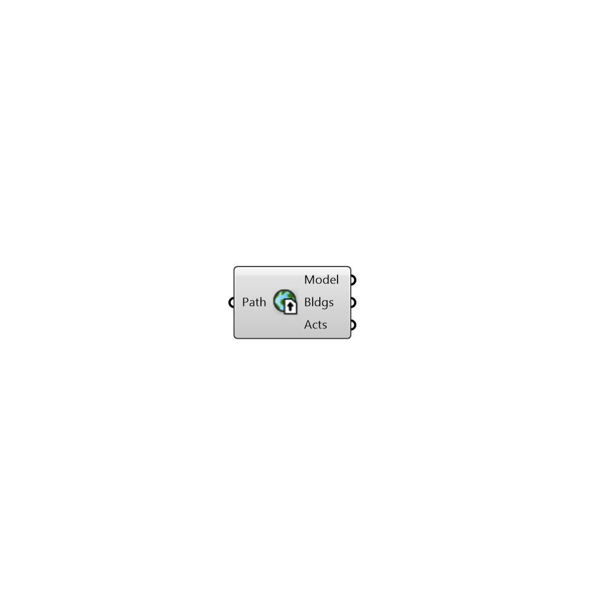

#  Import Urbano Model

Import Urbano Model from file path or URL

#### Inputs
* ##### Path []
File Path or URL for the resource. URL resources will be cached.

#### Outputs
* ##### Model
Urbano model containing buildings with amenities and network
* ##### Bldgs
Curves representing buildings in the Urbano model
* ##### Acts
Activities for which amenities are present in the Urbano model