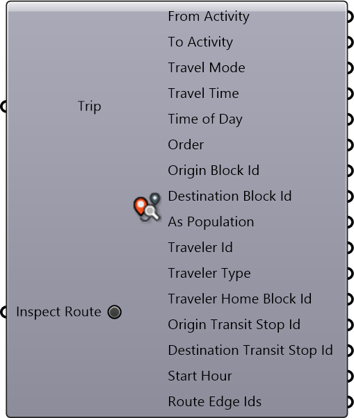

#  Inpsect Trip

Inpsect Trip

#### Inputs
* ##### Trip []
Trip
* ##### Inspect Route []
Get the output of 'Route Edge Ids'.

#### Outputs
* ##### From Activity
From Activity
* ##### To Activity
To Activity
* ##### Travel Mode
Travel Mode
* ##### Travel Time
Travel time in minutes
* ##### Time of Day
Time of Day
* ##### Order
Order
* ##### Origin Block Id
Origin Block Id
* ##### Destination Block Id
Destination Block Id
* ##### As Population
As Population
* ##### Traveler Id
Traveler agent's index within the home location
* ##### Traveler Type
Traveler Type (Type 1-8)
* ##### Traveler Home Block Id
Traveler Home Block Id
* ##### Origin Transit Stop Id
Origin Transit Stop Id
* ##### Destination Transit Stop Id
Destination Transit Stop Id
* ##### Start Hour
Start Hour
* ##### Route Edge Ids
Route Edge Ids