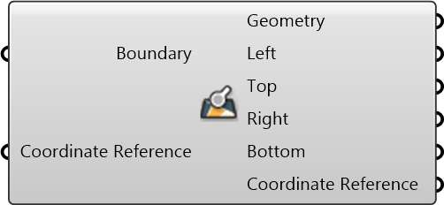

#  Inspect Boundary

Inspect Boundary

#### Inputs
* ##### Boundary []
A string representing geographical boundary
* ##### Coordinate Reference []
Coordinate reference information for properly locating the geometries in the Rhino canvas

#### Outputs
* ##### Geometry
Geometry
* ##### Left
Minimum longitude, left boundary.
* ##### Top
Maximum latitude, top boundary.
* ##### Right
Maximum longitude, right boundary.
* ##### Bottom
Minimum latitude, bottom boundary.
* ##### Coordinate Reference
Coordinate reference information for properly locating the geometries in the Rhino canvas