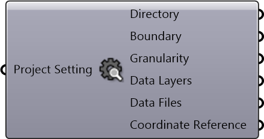

#  Inspect Project Setting

Inspect Project Setting

#### Inputs
* ##### Project Setting []
Project Setting

#### Outputs
* ##### Directory
Project directory to save and cache files
* ##### Boundary
A string representing geographical boundary
* ##### Granularity
Granularity
* ##### Data Layers
Data Layers
* ##### Data Files
Data Files
* ##### Coordinate Reference
Coordinate reference information for properly locating the geometries in the Rhino canvas