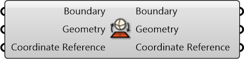

#  Project Geographic Boundary

Project geographic boundary

#### Inputs
* ##### Boundary []
A string representing geographical boundary
* ##### Geometry []
Geometry
* ##### Coordinate Reference []
Coordinate reference information for properly locating the geometries in the Rhino canvas

#### Outputs
* ##### Boundary
A string representing geographical boundary
* ##### Geometry
Geometry
* ##### Coordinate Reference
Coordinate reference information for properly locating the geometries in the Rhino canvas