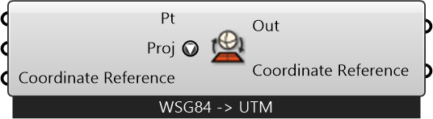

#  Project Geographic Point

Project geographic points between WSG84 (lat,long) and UTM coords

#### Inputs
* ##### Pt []
Point to project
* ##### Proj []
Project geograhic points from Lat-long (WSG84) to UTM and vice-versa
* ##### Coordinate Reference []
Coordinate reference information for properly locating the geometries in the Rhino canvas

#### Outputs
* ##### Out
Projected Point
* ##### Coordinate Reference
Coordinate reference information for properly locating the geometries in the Rhino canvas