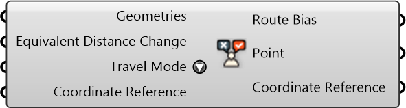

#  Route Biases

Route Biases

#### Inputs
* ##### Geometries []
Geometries
* ##### Equivalent Distance Change []
Equivalent change in the perceived distance (+/- meter) for each element on the street segment.
* ##### Travel Mode []
Travel Mode
* ##### Coordinate Reference []
Coordinate reference information for properly locating the geometries in the Rhino canvas

#### Outputs
* ##### Route Bias
Route Bias
* ##### Point
Point
* ##### Coordinate Reference
Coordinate reference information for properly locating the geometries in the Rhino canvas