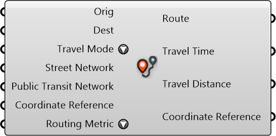

#  Router

Find a trip between two places (buildings/points/curves) using the specified mode

#### Inputs
* ##### Orig []
Origin Point/Building
* ##### Dest []
Destination Point/Building
* ##### Travel Mode []
Travel Mode
* ##### Street Network []
Street Network
* ##### Public Transit Network []
Public Transit Network
* ##### Coordinate Reference []
Coordinate reference information for properly locating the geometries in the Rhino canvas
* ##### Routing Metric []
Routing Metric

#### Outputs
* ##### Route
Curve representing the route of the trip
* ##### Travel Time
Travel time in minutes
* ##### Travel Distance
Travel distance in meters
* ##### Coordinate Reference
Coordinate reference information for properly locating the geometries in the Rhino canvas