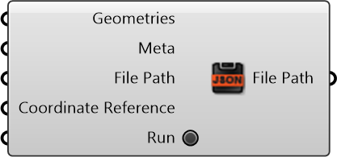

#  Save Data To Geojson

Save Data To Geojson

#### Inputs
* ##### Geometries []
Geometries
* ##### Meta []
Serializable dictionary with string keys and arbitrary values
* ##### File Path []
File Path
* ##### Coordinate Reference []
Coordinate reference information for properly locating the geometries in the Rhino canvas
* ##### Run []
Run

#### Outputs
* ##### File Path
File Path