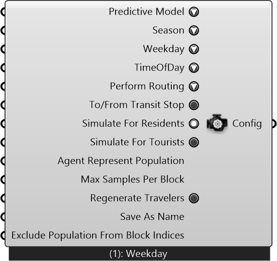

#  Simulation Configuration

Simulation Configuration

#### Inputs
* ##### Predictive Model []
Predictive Model
* ##### Season []
Season
* ##### Weekday []
Weekday
* ##### TimeOfDay []
Time of Day
* ##### Perform Routing []
Perform routing to get Travel Flow output.This process can be time-consuming for large model
* ##### To/From Transit Stop []
To/From Transit Stop
* ##### Simulate For Residents []
Simulate For Residents
* ##### Simulate For Tourists []
Simulate For Tourists
* ##### Agent Represent Population []
Agent Represent Population
* ##### Max Samples Per Block []
Max Samples Per Block
* ##### Regenerate Travelers []
Regenerate Travelers
* ##### Save As Name []
Save As Name
* ##### Exclude Population From Block Indices []
Exclude Population From Block Indices

#### Outputs
* ##### Config
Config