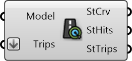

#  Street Hits

Street Hits Counter

#### Inputs
* ##### Model []
Urbano model containing buildings with amenities and network
* ##### Trips []
Trips that are used to compute hits

#### Outputs
* ##### StCrv
Street Segments
* ##### StHits
Street Hits which evaluate how many people use a certain street segment
* ##### StTrips
Trips that use that street