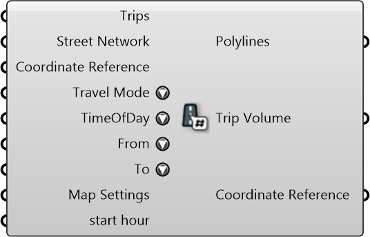

#  Trip Volume By Streets

Trip Volume By Streets

#### Inputs
* ##### Trips []
Trips
* ##### Street Network []
Street Network
* ##### Coordinate Reference []
Coordinate reference information for properly locating the geometries in the Rhino canvas
* ##### Travel Mode []
Travel Mode
* ##### TimeOfDay []
Time of Day
* ##### From []
From Activity
* ##### To []
To Activity
* ##### Map Settings []
Map Settings
* ##### start hour []
start hour

#### Outputs
* ##### Polylines
Street Polylines
* ##### Trip Volume
Trip Volume
* ##### Coordinate Reference
Coordinate reference information for properly locating the geometries in the Rhino canvas