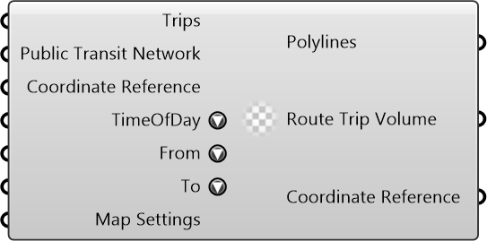

#  Trip Volume By Transit

Trip Volume By Transit

#### Inputs
* ##### Trips []
Trips
* ##### Public Transit Network []
Public Transit Network
* ##### Coordinate Reference []
Coordinate reference information for properly locating the geometries in the Rhino canvas
* ##### TimeOfDay []
Time of Day
* ##### From []
From Activity
* ##### To []
To Activity
* ##### Map Settings []
Map Settings

#### Outputs
* ##### Polylines
Route Polylines
* ##### Route Trip Volume
Route Trip Volume
* ##### Coordinate Reference
Coordinate reference information for properly locating the geometries in the Rhino canvas