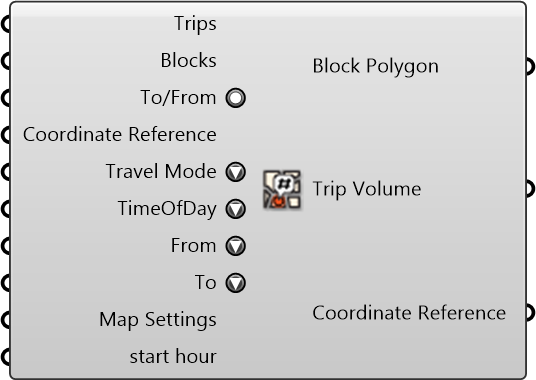

#  Trip Volume From/To Blocks

Trip Volume From/To Blocks (Trips from/to transit stops will be ignored to avoid double-counting trips for the same blocks)

#### Inputs
* ##### Trips []
Trips
* ##### Blocks []
Blocks
* ##### To/From []
'To' if true, 'From' if false
* ##### Coordinate Reference []
Coordinate reference information for properly locating the geometries in the Rhino canvas
* ##### Travel Mode []
Travel Mode
* ##### TimeOfDay []
Time of Day
* ##### From []
From Activity
* ##### To []
To Activity
* ##### Map Settings []
Map Settings
* ##### start hour []
start hour

#### Outputs
* ##### Block Polygon
Block Polygon
* ##### Trip Volume
Trip Volume
* ##### Coordinate Reference
Coordinate reference information for properly locating the geometries in the Rhino canvas