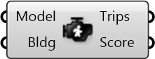

#  WalkScore Trip Engine

Generate trips based on the activity demand profile in the WalkScore.com methodology

#### Inputs
* ##### Model []
Urbano model containing buildings with amenities and network
* ##### Bldg []
Building to compute WalkScore for

#### Outputs
* ##### Trips
Trips generated in the WalkScore engine
* ##### Score
Walkability score computed using methodology given by WalkScore.com