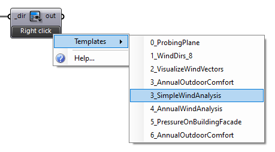
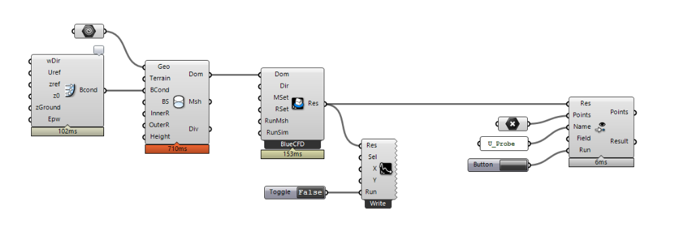

# Eddy3D &mdash; Outdoor

## Installation

- Install [Eddy3D](https://www.eddy3d.com/download/)
- Install BlueCFD in the default folder:
  - For versions <= 0.3.8.0, please install [BlueCFD 2017](https://github.com/blueCFD/Core/releases/download/blueCFD-Core-2017-2/blueCFD-Core-2017-2-win64-setup.exe) in the default folder:
    - `C:\Program Files\blueCFD-Core-2017`
  - For versions >= 0.4.0.10, please install [BlueCFD 2020](https://github.com/blueCFD/Core/releases/download/blueCFD-Core-2020-1/blueCFD-Core-2020-1-win64-setup.exe) in the default folder:
    - `C:\Program Files\blueCFD-Core-2020`
- If you would like to use the *experimental* MRT component, please install [Radiance](https://www.radiance-online.org/download-install) in the default  
  folder: `C:\Program Files\Radiance`

### Templates

- Eddy comes with starter templates that you can find by right clicking on the `Template`  
  component, see below.

- Select a template of your choice and follow the enumerated markers through the canvas.

### Parallel computation

There is currently an issues with Microsoft’s and BlueCFD’s MPI dll which is why a run with multiple CPUs might fail. You need both dlls to be the same file, see [here](https://www.cfd-online.com/Forums/openfoam-installation/200437-bluecfd-core-2016-user-compiled-solvers-not-running-parallel.html#post687582) for instructions on how to ensure that.

### Simple workflows

We value efficient workflows! See below for a one-directional urban CFD setup.

## Video tutorials

### Simple wind analysis

<iframe title="vimeo-player" src="https://player.vimeo.com/video/375687568?h=4faaa776b4" width="640" height="360" frameborder="0"    allowfullscreen></iframe>

### Multi-directional / annual wind analysis

<iframe title="vimeo-player" src="https://player.vimeo.com/video/375755947?h=3ca10bad2b" width="640" height="360" frameborder="0"    allowfullscreen></iframe>

### Pressure coefficients on building façade

<iframe title="vimeo-player" src="https://player.vimeo.com/video/375755963?h=ad2f57624d" width="640" height="360" frameborder="0"    allowfullscreen></iframe>

